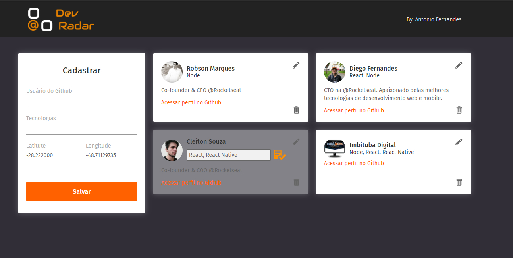

# Dev Radar - Front-end React

Implementação realizada por: **Antonio Joaquim Fernandes**
- Contato: **imbitubadigital@gmail.com**

## Vídeo da Aplicação
 [CLIQUE AQUI E ASSISTA O VÍDEO DESMONSTRATIVO](https://www.youtube.com/watch?v=jgRliPP8cWU)

## Especificações:

Projeto idealizado durante a Semana Oministck 10 da Rocketseat, tendo como objetivo o desenvolvimento do **Front-end React**, da aplicação **Dev Radar** conforme as regras de negócios implementadas no [Beckend](https://github.com/imbitubadigital/beckend-dev-radar) da aplicação .

## Desafio Pessoal

Como desafio pessoal foi integrado:

- Edição das Tecnologias
- Funcionalidade para deletar Dev
- typescript ao projeto
- hooks de contexto

### Beckend da Aplicação

[Clique aqui](https://github.com/imbitubadigital/beckend-dev-radar) para visualizar e baixar o **Backend** da aplicação desenvolvido em **Node com Express**

### Projeto Aplicativo Mobile - React Native

[Clique aqui](https://github.com/imbitubadigital/dev-radar-mobile) para visualizar e baixar o projeto do aplicativo mobile desenvolvido em **React Native**

